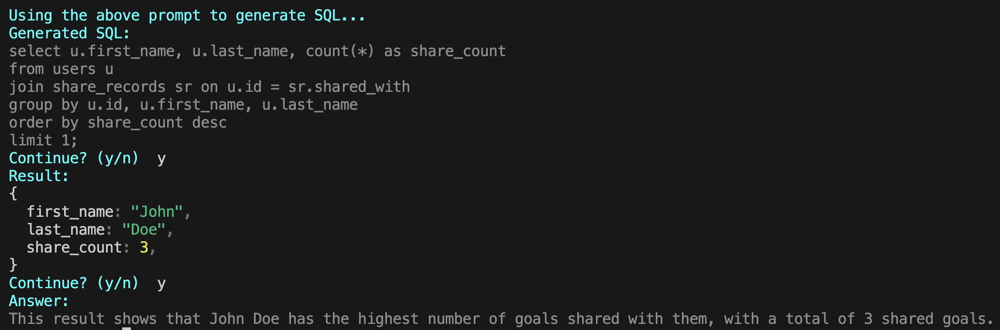

# natlang-sql
This is an AI commandline tool to answer natural language questions about a sqlite database.

## Usage
To install dependencies:

```bash
bun install
```

To run:

```bash
bun start
```

## Database Schema


## Examples


For more examples, see: [Example Conversation 2](./examples/example_conversation_2.txt)